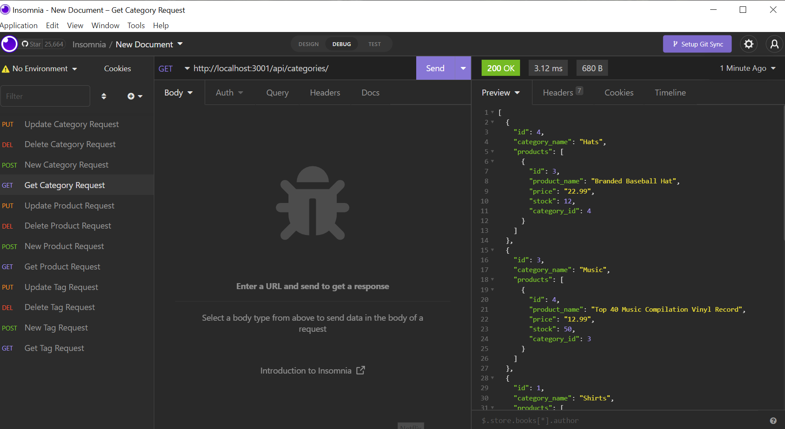
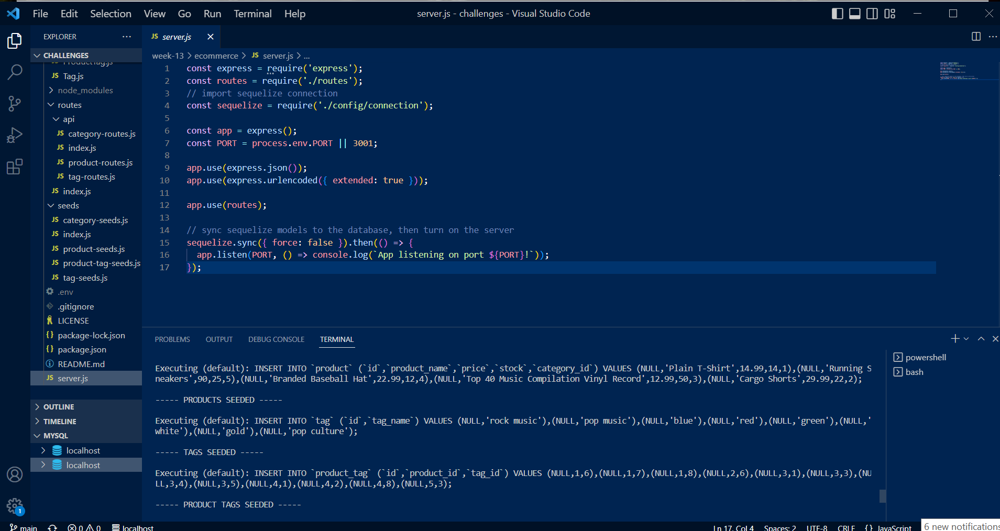

# Week Thirteen Challenge: eCommerce Database

## Description

This repository is where I refactor code to create an app for managing an eCommerce database.

## Installation

N/A

## Usage

Run node.js to initiate the eCommerce back end application. You can view and edit the database by using the relevant api route and paramaters in Insomnia.

Link to walkthrough video: (https://watch.screencastify.com/v/695OrJQ36C1gc3V4lNWg)

## Credits

Starter code provided by Monash University.

The following resources were referenced to ensure best practice and adherence to appropriate conventions:

MySQL2 documentation via npm: (https://www.npmjs.com/package/mysql2)

Sequelize documentation via npm: (https://www.npmjs.com/package/sequelize)

dotenv documentation via npm: (https://www.npmjs.com/package/dotenv)

Sequelize documentation on data types via Sequelize: (https://sequelize.org/docs/v6/core-concepts/validations-and-constraints/)

Sequelize documentation on Eager Loading via Sequelize: (https://sequelize.org/docs/v6/advanced-association-concepts/eager-loading/)

Common js functions and parameters, for loops and arrays: JS CheatSheet by HTML CheatSheet (https://htmlcheatsheet.com/js/)

## License

Licensed under the standard MIT license. Please refer to the license in the repo for more information.